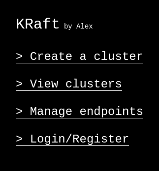

# KRaft

Have **you** ever wanted to run a workshop on Kubernetes? Or just run a lab somewhere? Nothing super permanent or important -- you'll delete it when your workshop or tests are done. And you probably want to leave it on the cloud to keep it OS-agnostic -- you don't want users on Windows, Mac, or Linux struggling with the hundred different ways to run Kubernetes.

Well, KRaft is for you.

## What is KRaft?
KRaft provides a very opinionated but fully-contained platform which runs on top of a host Kubernetes cluster, and spins up virtual clusters for each person who wants one. You can use this for workshops and training sessions. Or you can try it out as "cloud service provider" for you and your friends to share resources over a lab.

From my perspective, KRaft is a *Cloud in a Box* though people who love "-aas"ing everything will call this Kubernetes as a Service. And, to be honest, it's not fair from being a "cloud platform from Wish".

## What is KRaft not?
If you're after some kind of professional, very thorough implementation of your own cloud for workshops, you should look at Rancher's project called HobbyFarm which is miles more corporate-flavoured than this. To add, if you want the developers of the platform to be serious and professional, then you do *not* want to use KRaft.

KRaft was an excuse for me to write Rust while solving a problem and follows the "do it for fun" principles. Therefore, if you want an unpolished project with character, here it is!

## Structure
The application is made of a bunch of microservices, each taking care of some part of the platform. Also helps that I can write bits in different languages.

### Current Features:
- **Cluster Manage** - the core of the platform, giving facilities to create and list clusters.
- **Auth** - takes care of everything for login and registration.
- **Frontend** - the pretty UI you interact with, with the power of plain HTML.
- **Database** - stores user details and the list of clusters.

### Incoming Features:
- **DNS/Ingress Management** - creates ingress routes for the clusters running on the host.
- **Resource Manage** - allows me to, maybe in the future, bill users for cluster usage.
- **Payment Processing?** - to make my friends contribute to my electricity bill.

## Contributing
Contributions are always welcome!
Just check the issues page and let me know if you'll take one on. Though, if you choose to help, please talk to me about it so I don't have to review thousand-line PRs which lack a soul.

One limitation on all contributions - I will automatically reject any PRs with code written (mainly?) by LLMs and forward you to [justforfunnoreally.dev](https://justforfunnoreally.dev/) because you evidently need to learn to have fun with programming again.

## How to Host This?
You can totally host this on your own Kubernetes cluster! Though in development, I totally skipped on making this distributable, so you'll have to wait on yours-truly to make this easier.

1. Clone repo
2. Build all the services (refer to Makefile)
3. Edit the domain (I hardcoded kraft.alexbissessur.dev, oops)
4. Check the manifests folder and follow the steps there
5. Deploy with your choice of CI/CD
6. Enjoy for an hour
7. Fill my GH issues with ideas and problems

## The story of why this exists
> this is just me yapping, TLDR is that the previous version of this mess was an even more disastrous mess.

A long time ago, back in 2024 at Mauritius's Developer's Conference, I had organised a workshop on Kubernetes. Back then, I created a simple Python API with Flask, to use VCluster to create virtual clusters for the attendees.

In my defense, it did technically work, but it was held together by duct tape and glue. In fact, because of limitations on my host cluster, my program failed silently and it was *absolute* chaos. It definitely didn't help that I had so many attendees.

Sooo, recently, I got the courage to try rebuilding it. Properly this time. Give it a nice UI, make it more polished, and add a couple extra features. When I talked about K3k with the Rancher people at the SUSE/Rancher event on Day 0 of Kubecon Europe, I got that little extra push to make KRaft happen.

So yeah, I think this is kinda cool.
