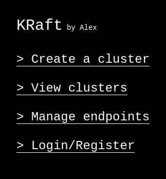

# KRaft
    

Have **you** ever wanted to run a workshop on Kubernetes? Or just run a lab somewhere? Nothing super permanent or important -- you'll delete it when your workshop or tests are done. And you probably want to leave it on the cloud to keep it OS-agnostic -- you don't want users on Windows, Mac, or Linux struggling with the hundred different ways to run Kubernetes.

Well, KRaft is for you.

## What is KRaft?
KRaft provides a very opinionated but fully-contained platform which runs on top of a host Kubernetes cluster, and spins up virtual clusters for each person who wants one. You can use this for workshops and training sessions. Or you can try it out as "cloud service provider" for you and your friends to share resources over a lab.

From my perspective, KRaft is a *Cloud in a Box* though people who love "-aas"ing everything will call this Kubernetes as a Service. And, to be honest, it's not fair from being a "cloud platform from Wish".

## What is KRaft not?
KRaft is not thorough - I have not thought of every kind of workshop which is held on Kubernetes and there's undoubtedly *stuff* somewhere I might have missed. I built KRaft from my experiences running workshops in the local tech community, and so maybe your needs won't be completely satisfied by what this project has to offer. KRaft is also not corporate-flavoured - from the UI design to the choices made in development, I favoured personality and character over looking and acting like an AWS dashboard (soulless)

KRaft was an excuse for me to write Rust while solving a problem and follows the "do it for fun" principles. Therefore, if you want an unpolished project with character, here it is!

## Structure
Since recently, the application is just a database, frontend, and backend. Postgres database, with an actix_web backend (Rust), and a static HTML+TailwindCSS to access it through.

### Current Features:
- **KRaft Core** - the core of the platform, with authentication, cluster & workspace management, and more
- **Frontend** - the pretty UI you interact with, with the power of plain HTML.
- **Database** - pg db with user details, clusters, workspaces, and some little extras.

### Future Features (maybe)
- Towonel support - expose your clusters and workloads through [Towonel](https://towonel.dev/), a sovereign, self-hostable alternative to Cloudflare Tunnels. 
- Helm chart - so now you too can turn that homelab in your living room into a cloud service provider for friends. Family approval factor not included.

## Contributing
Contributions are always welcome!
Just check the issues page and let me know if you'll take one on. Though, if you choose to help, please talk to me about it so I don't have to review thousand-line PRs which lack a soul.

One limitation on all contributions - I will automatically reject any PRs with code written (mainly?) by LLMs and forward you to [justforfunnoreally.dev](https://justforfunnoreally.dev/) because you evidently need to learn to have fun with programming again.

## How to Host This?
You can totally host this on your own Kubernetes cluster!

Refer to the documentation specifically on hosting KRaft [here](./!Docs/HowToHost.md).
Otherwise, you can just take the manifests in the manifests folder, change to [my Docker images](https://hub.docker.com/repositories/xelab04) and kubectl apply them.

## The story of why this exists
> this is just me yapping, TLDR is that the previous version of this mess was an even more disastrous mess.

A long time ago, back in 2024 at Mauritius's Developer's Conference, I had organised a workshop on Kubernetes. Back then, I created a simple Python API with Flask, to use VCluster to create virtual clusters for the attendees.

In my defense, it did technically work, but it was held together by duct tape and glue. In fact, because of limitations on my host cluster, my program failed silently and it was *absolute* chaos. It definitely didn't help that I had so many attendees.

Sooo, recently, I got the courage to try rebuilding it. Properly this time. Give it a nice UI, make it more polished, and add a couple extra features. When I talked about K3k with the Rancher people at the SUSE/Rancher event on Day 0 of Kubecon Europe in 2025, I got that little extra push to make KRaft happen.

So yeah, I think this is kinda cool.
